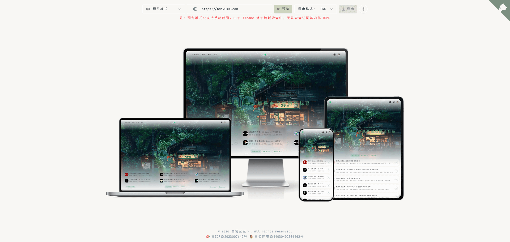
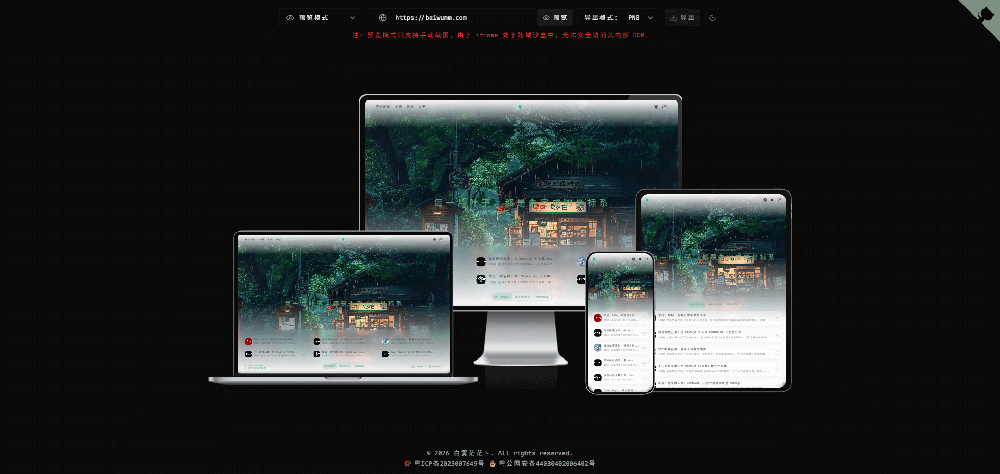

# Preview Craft
<p align="center">
  
  
  
  
</p>

**Preview Craft** 是一个现代化的网页多设备预览工具，旨在帮助开发者和设计师快速检视网页在不同设备上的显示效果。它支持实时交互预览和生成带壳截图，是展示作品和调试响应式布局的得力助手。

## 💻 演示预览

<div align="center">
  <h3>🌞 亮色模式</h3>
  
  
  <h3>🌙 暗色模式</h3>
  
</div>

## ✨ 特性 (Features)

- **📱 多设备同步预览**：支持 Desktop (电脑)、Laptop (笔记本)、Tablet (平板) 和 Mobile (手机) 四种主流设备尺寸同时预览。
- **🔄 双模式支持**：
  - **预览模式 (Preview Mode)**：基于 iframe 的实时预览，支持页面交互和滚动。
  - **导出模式 (Export Mode)**：生成高质量的带设备外壳截图，支持 PNG、JPG、WEBP 格式导出。
- **📸 强大的截图能力**：
  - 集成 `Puppeteer` 和 `@microlink/mql`，支持服务端截图，有效解决跨域限制。
  - 支持自定义视口大小和设备像素比。
- **🎨 现代化 UI/UX**：
  - 基于 Tailwind CSS v4 构建的精美界面。
  - 支持深色/浅色模式 (Dark/Light Mode) 切换。
  - 流畅的动画交互体验 (Motion)。
- **🛠️ 高度可配置**：支持为不同设备单独指定预览链接，满足特定场景下的调试需求。

## 🛠️ 技术栈 (Tech Stack)

- **框架**: [Next.js 16](https://nextjs.org/) (App Router)
- **UI 库**: [React 19](https://react.dev/), [Radix UI](https://www.radix-ui.com/)
- **样式**: [Tailwind CSS v4](https://tailwindcss.com/)
- **动画**: [Motion](https://motion.dev/)
- **工具**: [Lucide React](https://lucide.dev/) (图标), [Sonner](https://sonner.emilkowal.ski/) (Toast 通知)
- **截图服务**: [Puppeteer](https://pptr.dev/), [@microlink/mql](https://microlink.io/docs/sdk/getting-started/overview)
- **包管理**: [pnpm](https://pnpm.io/)

## 🚀 快速开始 (Getting Started)

### 前置要求

- Node.js >= 18
- pnpm

### 克隆项目
```bash
git clone https://github.com/baiwumm/preview-craft.git
```

### 安装依赖

```bash
cd preview-craft
pnpm install
```

### 环境变量配置

创建 `.env` 文件并添加以下配置：

```env
# 默认预览地址
NEXT_PUBLIC_PREVIEW_URL = 'baiwumm.com'
# 项目名称
NEXT_PUBLIC_APP_NAME = 'Preview Craft'
# 项目描述
NEXT_PUBLIC_APP_DESC = '为开发者准备的设备预览工具'
# 项目关键词
NEXT_PUBLIC_APP_KEYWORDS = '截图,预览,设备,手机,外壳,模拟器'
# 项目域名
NEXT_PUBLIC_APP_URL = 'https://preview.baiwumm.com'
# 版权
NEXT_PUBLIC_COPYRIGHT = '白雾茫茫丶'
# 网站ICP
NEXT_PUBLIC_ICP = '粤ICP备2023007649号'
# 网站公网备案
NEXT_PUBLIC_GUAN_ICP = '粤公网安备44030402006402号'
```

### 启动开发服务器

```bash
pnpm dev
```

打开浏览器访问 [http://localhost:5173](http://localhost:5173) 即可看到效果。

### 构建生产版本

```bash
pnpm build
pnpm start
```

## 📂 项目结构 (Project Structure)

```
.
├── src/
│   ├── app/                 # Next.js App Router 页面和 API 路由
│   │   ├── api/             # 后端 API (截图、Puppeteer 等)
│   │   └── page.tsx         # 主页面入口
│   ├── components/          # React 组件
│   │   ├── DeviceFrame/     # 设备外壳组件
│   │   ├── PreviewContainer/# 预览容器
│   │   └── ui/              # 通用 UI 组件 (Button, Input 等)
│   ├── enums/               # 常量枚举 (设备定义、模式等)
│   ├── hooks/               # 自定义 Hooks
│   └── lib/                 # 工具函数
├── public/                  # 静态资源
└── ...配置文件
```

## 🤝 贡献 (Contributing)

欢迎提交 Issue 和 Pull Request！

1. Fork 本仓库
2. 创建特性分支 (`git checkout -b feature/AmazingFeature`)
3. 提交更改 (`git commit -m 'Add some AmazingFeature'`)
4. 推送到分支 (`git push origin feature/AmazingFeature`)
5. 提交 Pull Request

## 📄 许可证 (License)

本项目基于 MIT 协议开源。详见 LICENSE 文件。

## 👨‍💻 作者 (Author)

**baiwumm**

- Website: [baiwumm.com](https://baiwumm.com)
- GitHub: [@baiwumm](https://github.com/baiwumm)

## ⭐ Star History

<div align="center">
  
</div>
