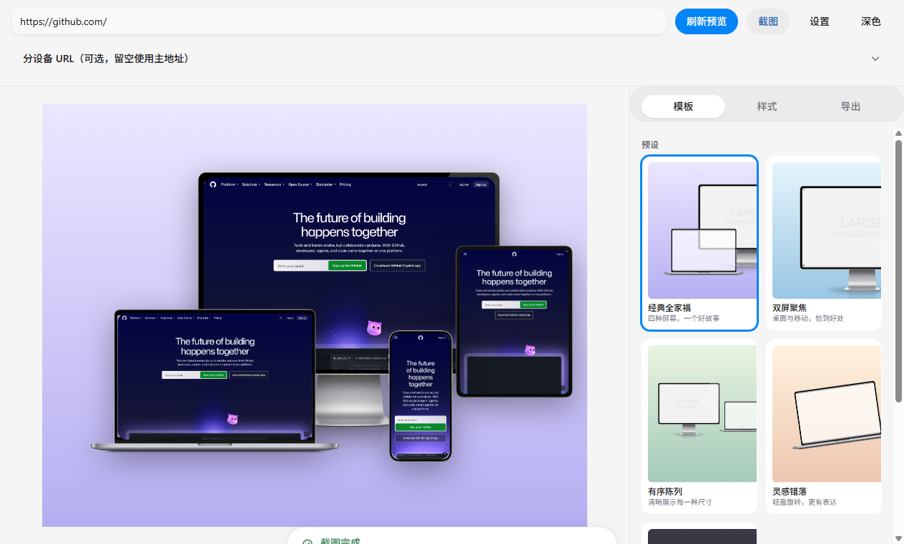
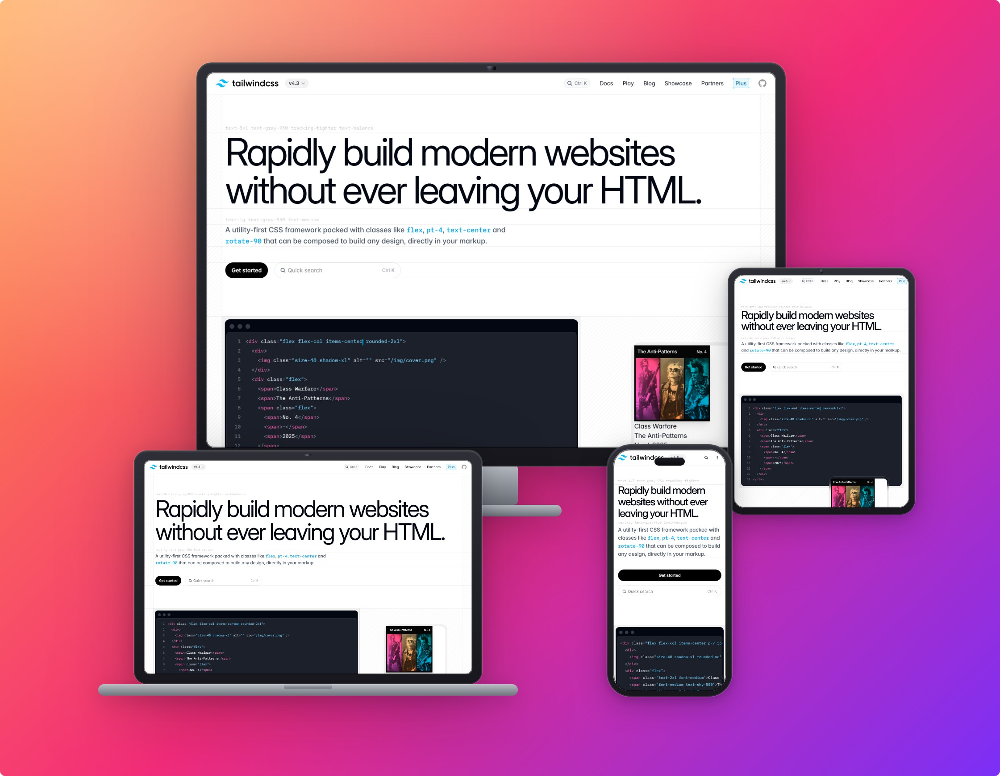

<p align="center">
  
</p>

# PreviewCraft Desktop

**粘贴一个 URL，拿到四种设备的真实截图，套上排版模板，导出高分辨率展示图。**

PreviewCraft 是一个 Electron 桌面工具，面向需要展示「同一站点在多端效果」的场景（作品集、产品发布、方案汇报）。它调用本机 Chrome/Edge 按各设备视口真实渲染并截图，再把截图嵌进设备壳与排版模板，导出 1x/2x/3x 的 PNG / JPG / WebP。

单用户本地工具：无账号、无服务端、除访问目标网站外完全离线可用。



## 功能

| 能力 | 说明 |
| --- | --- |
| 真实截图 | puppeteer-core 驱动本机 Chrome / Edge；检测不到浏览器时引导一键下载 Chromium（带下载进度） |
| 设备预设 | 电脑 1440×950 / 笔记本 1366×891 / 平板 768×1020 / 手机 390×840（含 iPad、iPhone UA 与移动端触摸标记），2x 视口截图 |
| 等待策略 | `domcontentloaded` → 字体就绪 → iframe 全部 load + 2s → 图片全部 complete → 冻结动画 CSS → 双 rAF，再落屏 |
| 模板系统 | 5 套预设（经典全家福 / 双屏聚焦 / 有序陈列 / 灵感错落 / 移动主角）+ 自定义模板另存、删除 |
| 样式定制 | 6 块背景板与自定义渐变、画布圆角、设备阴影、整体缩放、每台设备 X / Y / 宽度 / 旋转 |
| 导出 | 隐藏窗口按 1x/2x/3x 合成 → PNG（无损）/ JPG（quality 90）/ WebP，保存对话框 + 自动复制到剪贴板 |
| 预览 | 预览态用 iframe 实时渲染，截图态所见即所得；单台失败可在画布上单独重试 |
| 体验 | 明暗主题、快捷键、设置与自定义模板持久化（electron-store）、错误中文归因 Toast |

### 快捷键

| 按键 | 作用 |
| --- | --- |
| `Ctrl + Enter` | 按当前模板逐设备截图（结果回填画布） |
| `Ctrl + S` | 截图 + 合成 + 导出（保存对话框，同时写入剪贴板） |
| `Ctrl + V` | 焦点不在输入框时，把剪贴板网址贴进地址栏并刷新预览 |

快捷键在窗口聚焦时生效（renderer 监听），不注册系统全局快捷键。

## 导出样例



## 安装

1. 获取安装包 `PreviewCraft-Setup-<version>.exe`：从 [Releases](https://github.com/baiwumm/preview-craft/releases/latest) 下载，或自行构建（见下节，产物在 `release/`）。
2. 双击安装：简体中文安装界面，可选择安装目录，自动创建桌面与开始菜单快捷方式。
3. 首次使用若本机没有 Chrome / Edge，应用会弹出引导，一键下载 Chromium（约 150 MB，保存在应用数据目录，不改动系统浏览器、不写注册表）。

卸载会清除程序、快捷方式，并连同应用数据目录 `%APPDATA%\preview-craft`（设置与自定义模板）一并删除。

## 使用流程

1. 顶部地址栏粘贴网址回车 → 四设备 iframe 实时预览（可展开「分设备 URL」为某台单独指定地址，留空回落主地址）。
2. 右侧「模板」选排版，「样式」调背景 / 圆角 / 阴影 / 位置（微调仅作用于当前会话，另存为模板才会持久化）。
3. 点「截图」或 `Ctrl + Enter` 用真实截图替换预览；点「导出」或 `Ctrl + S` 出图。

## 开发

环境要求：Windows 10 / 11、Node 20+、pnpm 9+；本机装有 Chrome 或 Edge（否则在应用内下载 Chromium）。

```bash
pnpm install        # .npmrc 已配置 Electron 与 electron-builder 二进制镜像（国内网络）
pnpm dev            # electron-vite 三层热更新，renderer 固定端口 5188（strictPort）
pnpm typecheck      # tsc --noEmit（node + web 两套 tsconfig）
pnpm lint           # eslint
pnpm build          # 编译到 out/
pnpm smoke          # 全量冒烟：纯逻辑断言 + 真实应用 CDP 端到端（需先 pnpm build）
pnpm verify         # typecheck + lint + build + smoke 一条龙
pnpm dist           # 打包 NSIS 安装包到 release/（首次运行见下方镜像说明）
pnpm dist:dir       # 只出免安装目录 release/win-unpacked/，用于快速冒烟
```

`pnpm smoke`（`scripts/smoke.mjs`）覆盖 URL 校验、设备几何、5 套预设越界检查、背景与样式解析、错误归因，
以及起真实应用后的截图（4 台 2x 尺寸逐台断言）、导出（PNG/JPG/WebP × 1x/2x/3x、透明底 alpha、垫白）、
剪贴板、模板 CRUD、设置与主题持久化、快捷键、失败重试与单实例锁。应用以 `--user-data-dir=.smoke-profile`
隔离运行，不改写用户设置；导出产物与日志留在 `.smoke-out/` 供目检。
加 `--exe=<路径>` 可改打打包产物（如 `release/win-unpacked/PreviewCraft.exe`），用于验证 NSIS 版内链路。

> 打包注意：electron-builder 不读取 `.npmrc`。首次执行 `pnpm dist` 前需显式设置镜像环境变量，否则 NSIS 资源下载会超时：
> `export ELECTRON_MIRROR=https://npmmirror.com/mirrors/electron/ ELECTRON_BUILDER_BINARIES_MIRROR=https://npmmirror.com/mirrors/electron-builder-binaries/`（PowerShell 用 `$env:` 逐个设置）。资源有缓存后无需重复设置。

### 目录结构

```
src/
├─ main/            # 主进程
│  ├─ index.ts      # 窗口与 IPC 注册
│  ├─ browser.ts    # 浏览器检测 / Chromium 下载（含真实下载进度）
│  ├─ capture.ts    # 截图引擎（puppeteer-core）+ 临时缓存统计与清理
│  ├─ export.ts     # 隐藏窗口高分辨率合成导出
│  └─ store.ts      # electron-store（设置 / 自定义模板）
├─ preload/         # contextBridge，唯一 IPC 入口
├─ renderer/        # React 19 + HeroUI v3 + Tailwind v4
│  ├─ src/components/  UrlBar / Canvas / DeviceFrame / TemplateGallery / StylePanel / ExportPanel / SettingsModal / BrowserGuideModal …
│  └─ templates/       模板 schema、5 套预设、背景板
└─ shared/          # 三层共用的类型契约、设备 preset、URL 规范化
docs/PLAN.md        # 开发计划与各阶段执行记录
```

（设备壳为纯 CSS 绘制，见 `src/renderer/src/components/DeviceShell.tsx`，几何规格在 `src/shared/devices.ts`。）

### 进程边界

`contextIsolation: true`、`nodeIntegration: false`、renderer 走 sandbox；renderer 只能通过 `window.api.*` 调用主进程。IPC 通道按命名空间划分：

| 命名空间 | 通道 |
| --- | --- |
| browser | `browser:detect`、`browser:download`、事件 `browser:download:progress` |
| capture | `capture:start`、事件 `capture:progress` |
| export | `export:compose`、`export:save`、`export:clipboard`、`export:render`、`export:ready`、`export:webp:convert` / `result` |
| settings / templates | `settings:get`、`settings:set`、`templates:get`、`templates:save`、`templates:delete` |
| 系统能力 | `cache:stats`、`cache:clear`、`dialog:pick-browser`、`clipboard:read-text`、`shot:dataurl` |

截图与导出产物先写入 `%TEMP%\preview-craft`，可在「设置 → 缓存」一键清理。

## 已知限制

- 带 `X-Frame-Options` / CSP `frame-ancestors` 的站点（如 GitHub）无法在**预览** iframe 中显示，属站点侧限制；**导出**走真实截图，不受影响。
- 单页截图等待上限 30 秒；不做 fullPage 长截图、登录态截图、批量 URL。
- 当前仅出 Windows NSIS 安装包；macOS / Linux 未配置分发。
- 后续计划见 [docs/PLAN.md](docs/PLAN.md) 的 Backlog 一节。

## 技术栈

Electron + electron-vite + electron-builder · React 19 + TypeScript (strict) + Tailwind CSS v4 + HeroUI v3 · puppeteer-core（驱动本机浏览器，@puppeteer/browsers 负责缺失时下载）· electron-store · pnpm。

## 许可

[MIT](LICENSE)
